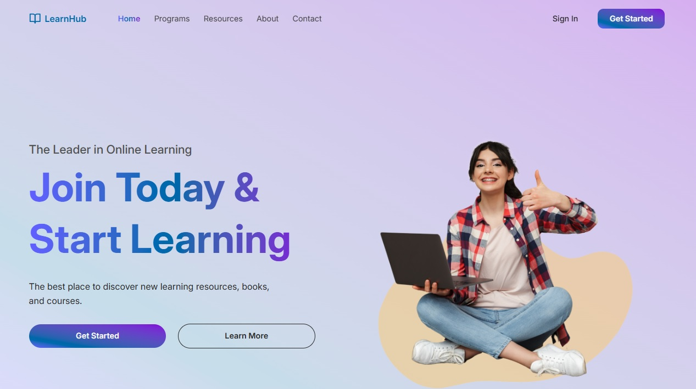
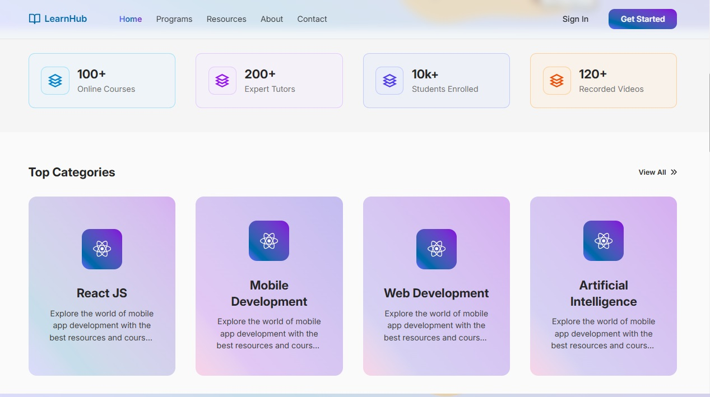
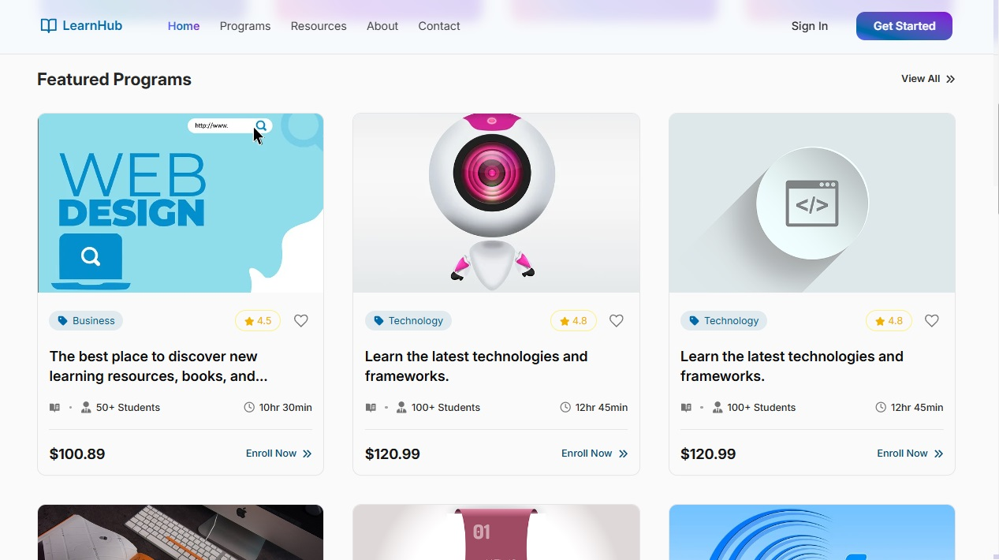
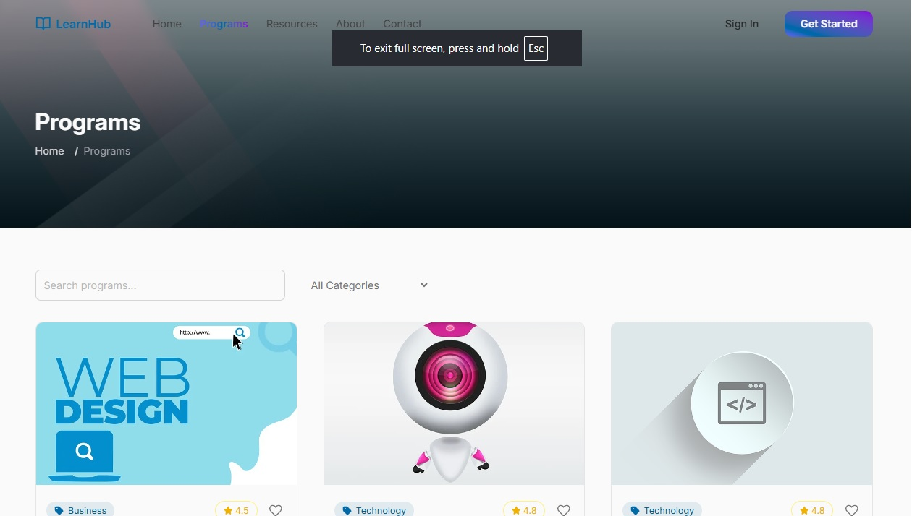
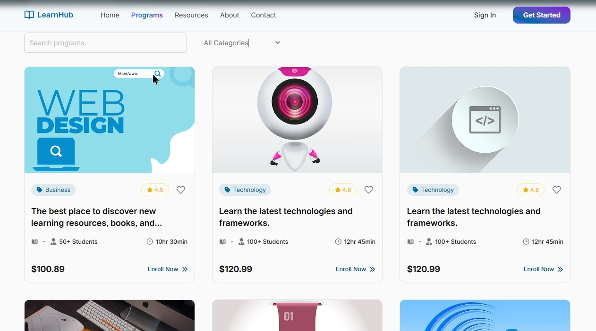
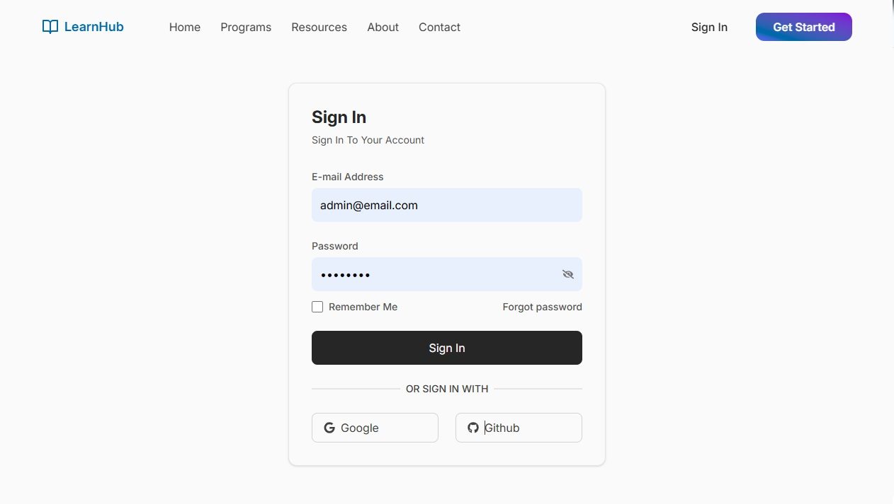

# 🚀 Learn TECH

O ECOSSISTEMA de Tecnologia, Ensino, Computação e Humano para treinamento de APRENDIZADO.

Com uma experiência de usuário impecável, a Learn TECH tem como objetivo acelarar a jornada para aperfeiçoar os resultados. 

A primeira versão será de curadoria de links e conteúdos estáticos.
A segunda versão trará conteúdos originais e personalizados.
 
## 📂 Plataforma de Aprendizado

- Um LMS (Learning Management System) é um Sistema de Gestão de Aprendizagem.
- Ele serve para:
    - Hospedar e organizar cursos online (aulas em vídeo, textos, PDFs, quizzes).
    - Gerenciar usuários (alunos, professores, administradores).
    - Acompanhar progresso e desempenho dos alunos.
    - Emitir certificados após conclusão de cursos ou trilhas.
    - Facilitar interações (fóruns, comentários, avaliações). 
- Exemplos famosos: Moodle, Udemy, Coursera, Hotmart. 

### 📷 Preview da versão em produção

(adicione aqui imagens ou GIFs mostrando a interface do projeto)

### 📂 Estratégia do Projeto

Para permitir acesso para todos que quiserem aprender tecnologia, a plataforma apresentará um conteúdo público da internet de forma organizada, ordenada e selecionada.

#### 🚀 OFF

Curadoria e ordenação de conteúdos da internet conforme os critérios adotados pelo Coordenador do nosso ECOSSISTEMA.

#### 🚀 ON

Jornada profissional e conteúdos originais personalizados para a prestação de consultoria, desenvolvimento de produtos e serviços. 

 
---


## 🚀 Workflow

- main: manter em produção
- developer: tratar testes e merge
- v1-original: versão inicial
- v2-conteudos-1: última versão estável
- v2-conteudos-2: versão em desenvolvimento

#### 👨‍💻 Como Executar Localmente

````gitbash
# Clone o repositório
git clone https://github.com/seu-usuario/seu-repo.git

# Acesse a pasta
cd seu-repo

# Instale as dependências
npm install

# Rode o projeto
npm run dev
````


---


## 🚀 VERSÃO 2-2

- Desenvolvimento do projeto com os conteúdos originais
- v2-conteudos-2: versão de organização de tarefas
- v2-conteudos-2-1-home: versão de desenvolvimento da seção home

### 📚 Learn TECH

- 🌟 HOME 🌟:
- [x] Imagem de destaque da Home em formato e em carrossel
- [x] Index: nome, favicon
- [x] criar LearnTechTitle: logo reutilizável
- [x] Navbar: nome, logo componentizado. Home (Home), Programs (Programas), Resources (Recursos), About (Learn TECH), Contact (Fala aê), Sign In (Entre), Get Started (Cadastra-se)
- [x] Home:
  - [x] Subtítulo: The Leader in Online Learning
  - [x] Título: Join Today & Start Learning
  - [x] Descrição: The best place to discover new learning resources, books, and courses 
  - [x] Botão CTA: Comece agora: levar para o "TOP Projetos"
  - [x] Botão CTA: Saiba mais: levar para "Stats"
- [x] Stats: online courses, expert tutors, students enrolled, recorded videos. Por: Javascript, HTML, CSS, ReactJS, Git, Github, NodeJS
- [x] Categories: View All, Top Categories, Icons, Descriptions. Por: Web, Frontend, UX/UI, Backend, DataBase, ProdutosDigitais, Projetos, English
- [x] Rever logos: Web, Frontend, UX/UI, Backend, DataBase, Produtos Digitais, Projetos, English 
- [x] Botão fixed ao topo + Cursor pointer
- [x] Projetos: 
  - [x] exibir um card para cada categoria
  - [x] botão "ver todos" levar para a página programas
  - [x] hover no card
- [x] Comportamentos: Soft skills em cursos: uma página em construção
- [x] Prêmios: Mentorias em cursos: uma página em construção
- [x] Blogs: Artigos em cursos: uma página em construção
- [x] Footer: colunas 1, 2, 3, 4 e Copyright
  - [x] Copyright Real Time: criar uma consulta do dia que o site está sendo acessado

- 🌟 Page Error 🌟: 
  - [x] NotFound 
  - [x] UnderConstruction

- 🌟 PROGRAMS 🌟: 
- [x] Busca por texto do título no input
- [x] Filtro por categoria no select
- [x] Contador de resultados da busca e do filtro
- [x] Exibir apenas 4 cards. Cada vez que o usuário clicar no botão “Ver mais” → carregar +6 cards. 
- [x] memorizar o resultado da busca com useMemo
- [x] Estruturar programas por centenas: web (1 a 100), frontend (101 a 200), ux-ui (201 a 300), backend (301 a 400), data-base (401 a 500), produtos-digitais (501 a 600), projetos (601 a 700), english (701 a 800) 
- [ ] Para cada card, uma página especialista
- [ ] hover no card
- [ ] Home: a home exibe uma breve demonstração do que cada tipo de conteúdo tem para apresentar. Cada tipo de conteúdo está no menu
- [ ] Fazer para 3 programas:
  - /program/detail
  - /program/${categoryFilter}/${id}

- 🌟 RECURSOS 🌟
- 🌟 LEARN TECH 🌟
- 🌟 FALA AÊ 🌟
- 🌟 LOGIN 🌟
- 🌟 REGISTER 🌟
- 🌟 Comportamentos 🌟: criar uma página com uma lista de cards de artigos, criar uma página para cada artigo 
- 🌟 Prêmios 🌟: criar uma página com uma lista de cards de artigos, criar uma página para cada artigo
- 🌟 Blogs 🌟: criar uma página com uma lista de cards de artigos, criar uma página para cada artigo
- 🌟 Footer: 
  - [ ] coluna 1 com a chamada do hero  
  - [ ] coluna 2 Customer: (faq, contact us, returns, shipping)
  - [ ] coluna 3 Quick Links: (about us, terms of service, privacy policy, careers)
  - [ ] coluna 4 Follow Us: (Instagram, Linkedin, Youtube, Facebook, X)
  - [ ] Copyright Real Time: criar uma consulta do dia que o site está sendo acessado


---

## 🚀 VERSÃO 1

Desenvolvimento do projeto Inicial

### 📚 LearnHub — Plataforma LMS Online Responsiva

🌟 Uma plataforma de Educação Online (LMS) desenvolvida com ReactJS e TailwindCSS, moderna, responsiva e com foco em experiência do usuário.

#### 🚀 Visão Geral

Este projeto é inspirado em plataformas como Udemy, trazendo recursos essenciais de um Learning Management System (LMS):

    - Exibição de cursos, categorias e estatísticas
    - Páginas de programas e detalhes
    - Player de vídeo embutido
    - Sistema de quizzes
    - Blog integrado
    - Design 100% responsivo

Construído passo a passo para ser acessível tanto a iniciantes quanto a desenvolvedores experientes.

#### 📖 Roadmap do Desenvolvimento 

- 🎬 Intro <br>
Apresentação do objetivo do projeto: criação de uma plataforma LMS responsiva utilizando ReactJS + TailwindCSS.

- ⚙️ Project Setup <br>
Configuração inicial do ambiente com Vite, instalação do TailwindCSS e demais dependências.

- 🏠 Home Page <br>
Estrutura inicial da página principal com navegação e seções base.

- 🌟 Hero Section <br>
Seção de destaque da Home com chamada principal e imagem/banner ilustrativo.

- 📊 STATS Section <br>
Exibição de estatísticas (ex.: alunos, cursos, avaliações) em cards chamativos.

- 📂 Category Section <br>
Listagem de categorias de cursos para facilitar a navegação do usuário.

- 📚 Programs Section <br>
Apresentação dos programas/cursos disponíveis com cards detalhados.

- ⚡ Quick Access Section <br>
Área para navegação rápida entre recursos importantes da plataforma.

- 📝 Blog Section <br>
Sessão de artigos/posts com conteúdo educativo e informativo.

- 📄 Programs Page <br>
Página dedicada aos programas, exibindo lista completa de cursos disponíveis.

- 🏞️ Page Top Banner Components <br>
Componente reutilizável para exibir banners no topo das páginas internas.

- 🧭 Breadcrumb Components <br>
Componente de navegação (caminho de páginas) para melhorar a usabilidade.

- 📄 Programs Page (Contd...) <br>
Continuação da implementação da página de programas com detalhes adicionais.

- 📑 Details Page <br>
Página de detalhes de cada curso, com informações aprofundadas do conteúdo.

- 📝 Enroll Programs Page <br>
Página para inscrição do aluno no curso escolhido.

- 🎥 Video Player Section <br>
Componente de player de vídeo para exibir aulas.

- 🖊️ Description Section <br>
Sessão dedicada à descrição completa do curso.

- 🗂️ Tabs Components <br>
Componente de abas (tabs) para alternar entre seções do curso.

- 📋 Overview Tabs Section <br>
Aba de visão geral do curso.

- 📦 Resources Tabs Section <br>
Aba de recursos adicionais do curso (ex.: PDFs, links, materiais extras).

- ⭐ Reviews Tabs Section <br>
Aba de avaliações/comentários de alunos.

- 📈 Course Progress Section <br>
Exibição do progresso do aluno dentro do curso.

- ❓ Quiz Section <br>
Implementação de quizzes interativos para reforçar o aprendizado.

- 🔑 Sign In Page <br>
Página de login com autenticação de usuários.

- 🆕 Sign Up Page <br>
Página de registro para novos alunos.

- ✅ Final Product <br>
Produto final: plataforma LMS completa, responsiva e funcional.

- 🚀 Melhorias Futuras <br>
Dashboard do aluno, sistema de pagamentos, certificado digital.

#### 📷 Preview da interface do projeto

- 
- 
- 
- 
- 
- 
- 
- 
   
#### 🔗 Orientações:
 
- G-Tech Official - How to Create an Online LMS Education Website using React Js and Tailwind CSS | Like Udemy: https://www.youtube.com/watch?v=tiwu5UHCUhQ
 
#### 🔗 Baixar template inicial 

- Template: https://github.com/gtech-official08/l  
- Modelo: https://github.com/gtech-official08/lmssys-starter-template

#### 🛠️ Tecnologias Utilizadas

    - ReactJS ⚛️ https://react.dev/
    - TailwindCSS 🎨 https://tailwindcss.com/
    - Vite ⚡ https://vitejs.dev/
    - React Icons 🔗 https://react-icons.github.io/react-icons/

#### 🔗 Recursos

- 🎨 Imagens obtidas via Pixabay https://pixabay.com/
- 📦 Assets e snippets disponíveis no repositório 
- 🎨 Vídeo Demo: https://www.youtube.com/watch?v=C9Kj594dRxU 

### 🚀 Por: @douglasabnovato