# 🚀 Learn TECH

A Learn TECH tem como objetivo acelerar a jornada para aperfeiçoar os resultados.
Com uma experiência de usuário impecável, vamos construir um ECOSSISTEMA de (T)ecnologia, (E)nsino, (C)omputação e (H)umano para treinamento de APRENDIZADO.

🔗 **Em produção:** https://learn-tech-pied.vercel.app/

## 📂 Plataforma de Aprendizado

- Um LMS (Learning Management System) é um Sistema de Gestão de Aprendizagem.
- Ele serve para:
    - Hospedar e organizar cursos online (aulas em vídeo, textos, PDFs, quizzes).
    - Gerenciar usuários (alunos, professores, administradores).
    - Acompanhar progresso e desempenho dos alunos.
    - Emitir certificados após conclusão de cursos ou trilhas.
    - Facilitar interações (fóruns, comentários, avaliações).
- Exemplos famosos: Moodle, Udemy, Coursera, Hotmart.

### 📂 Estratégia do Projeto

Para permitir acesso para todos que quiserem aprender tecnologia, a plataforma apresenta um conteúdo público da internet de forma organizada, ordenada e selecionada.

#### 🚀 OFF — o que está sendo construído hoje

Curadoria e ordenação de conteúdos da internet conforme os critérios adotados pelo Coordenador do nosso ECOSSISTEMA.

**Decisão de set/2026: a plataforma é OFF-only.** Não há autenticação, sessão, login, cadastro ou conta de usuário. Todo o conteúdo é aberto. O progresso de módulos e o histórico de quiz ficam no `localStorage` do navegador do próprio visitante.

#### 🚀 ON — planejado, ainda não iniciado

Jornada profissional e conteúdos originais personalizados para a prestação de consultoria, desenvolvimento de produtos e serviços. Exigirá conta de usuário, e por isso está fora do escopo atual.

### 📚 Fontes de conteúdo

Os treinamentos são produzidos a partir de duas fontes:

1. **`src/constants/programsData.js`** — o catálogo e o conteúdo dos programas já publicados no projeto.
2. **Arquivos originais de cursos, treinamentos e anotações** — material próprio, que vira texto, depois roteiro de aula, depois programa.

---

## ▶️ Como rodar

```bash
# instalar dependências
npm install

# ambiente de desenvolvimento
npm run dev

# build de produção
npm run build

# pré-visualizar o build
npm run preview

# checar o padrão de código
npm run lint

# rodar os testes do contrato de dados
npm test
```

O projeto sobe em `http://localhost:3000`.

### 🛠️ Stack

| Tecnologia | Versão | Uso |
| --- | --- | --- |
| [React](https://react.dev/) | 19 | interface |
| [Vite](https://vitejs.dev/) | 6 | build e dev server |
| [Tailwind CSS](https://tailwindcss.com/) | 4 | estilo |
| [React Router](https://reactrouter.com/) | 7 | rotas |
| [Vitest](https://vitest.dev/) | 4 | testes |
| [lucide-react](https://lucide.dev/) · [react-icons](https://react-icons.github.io/react-icons/) | — | ícones |

---

# 📁 Estrutura de Pastas — Learn TECH

> Levantada em 24/09/2026 a partir de `C:\ambiente-projeto\learn-tech`.
> `.git`, `node_modules` e `dist` estão omitidos por serem gerados.

## 🌳 Árvore

```text
learn-tech/
│
├── .github/                          # imagens de preview usadas no Readme
│   ├── original/                     # 8 telas da Versão 1
│   │   ├── 1-home.jpg
│   │   ├── 2-home.jpg
│   │   ├── 3-home.jpg
│   │   ├── 4-home.jpg
│   │   ├── 5-home.jpg
│   │   ├── 6-programas.jpg
│   │   ├── 7-programas.jpg
│   │   └── 8-signin.jpg
│   └── versao-2/                     # 15 telas da Versão 2
│       ├── 1-home-1.jpg  →  1-home-7.jpg
│       ├── 2-programas-1.jpg  →  2-programas-4.jpg
│       ├── 3-recursos-1.jpg  →  3-recursos-2.jpg
│       ├── 4-sobre-1.jpg
│       └── 5-contato-1.jpg
│
├── public/                           # servido na raiz, sem passar pelo build
│   ├── android-chrome-192x192.png
│   ├── android-chrome-512x512.png
│   ├── apple-touch-icon.png
│   ├── favicon-16x16.png
│   ├── favicon-32x32.png
│   ├── favicon.ico
│   └── site.webmanifest
│
├── src/
│   │
│   ├── assets/                       # imagens importadas pelo código
│   │   ├── devs/                     # dev-4.jpg … dev-7.jpg
│   │   ├── imgs/                     # 1-programs.png
│   │   ├── logo/                     # logo192.png
│   │   ├── originals/                # heros, logos SVG, page-top-bg, react.svg
│   │   ├── programs/                 # 1-demo.mp4 (47 MB), 1-demo-poster.jpg, 1-programs.png
│   │   └── setups/                   # dev-1 … dev-10 .avif
│   │
│   ├── components/                   # 15 componentes reutilizáveis
│   │   ├── blog/BlogCard.jsx
│   │   ├── breadcrumb/Breadcrumb.jsx
│   │   ├── category/CategoryCard.jsx
│   │   ├── common/ScrollToTop.jsx
│   │   ├── footer/Footer.jsx
│   │   ├── logo/
│   │   │   ├── assets/               # logo192.png, logo192.svg
│   │   │   └── LearnTechTitle.jsx
│   │   ├── nav/Navbar.jsx
│   │   ├── pageTop/PageTopBanner.jsx
│   │   ├── player/VideoPlayer.jsx
│   │   ├── programs/ProgramsCard.jsx
│   │   ├── reviews/ReviewsCard.jsx           ⚠️ órfão
│   │   ├── stats/StatsCard.jsx
│   │   ├── tabs/Tabs.jsx
│   │   └── videoGrid/
│   │       ├── VideoGrid.jsx
│   │       └── VideoModal.jsx
│   │
│   ├── constants/                    # a camada de dados — 14 arquivos + 1 teste
│   │   ├── aboutData.js
│   │   ├── aprenderData.js
│   │   ├── blogData.js
│   │   ├── careerData.js
│   │   ├── categoriesData.js
│   │   ├── falaaeData.js
│   │   ├── navbarData.js
│   │   ├── premiosData.js
│   │   ├── privacyData.js
│   │   ├── programsData.js           ⭐ fonte única do catálogo (120 KB)
│   │   ├── quizData.js               # quiz do programa 1
│   │   ├── statsData.js
│   │   ├── termsData.js
│   │   ├── testimonialData.js                ⚠️ órfão
│   │   └── dados.test.js             🧪 contrato de dados
│   │
│   ├── pages/                        # 29 páginas e seções
│   │   ├── about/About.jsx                       → /about
│   │   ├── account/                              ⚠️ órfão inteiro
│   │   │   ├── sigin/SignIn.jsx
│   │   │   └── signup/SignUp.jsx
│   │   ├── aprender/Aprender.jsx                 → /aprender
│   │   ├── career/Career.jsx                     → /careers
│   │   ├── detail/Detail.jsx                     → /program/:category/:id
│   │   ├── docs/
│   │   │   ├── Privacidade.jsx                   → /privacy
│   │   │   └── Termos.jsx                        → /terms
│   │   ├── enroll/                               → /program/:category/:id/enroll
│   │   │   ├── EnrollPrograms.jsx
│   │   │   ├── Description.jsx
│   │   │   ├── quiz/Quiz.jsx
│   │   │   └── tabContent/
│   │   │       ├── TabContent.jsx                # uma aba por módulo
│   │   │       └── ModuleRenderer.jsx            # renderiza qualquer módulo
│   │   ├── error/
│   │   │   ├── imgs/                             # 404 e em construção
│   │   │   ├── not-found.jsx                     → *
│   │   │   └── under-construction.jsx
│   │   ├── falaae/FalaAe.jsx                     → /falaae
│   │   ├── home/
│   │   │   ├── Home.jsx                          → /
│   │   │   ├── hero/
│   │   │   │   ├── assets/                       # dev-4 … dev-7 .JPG
│   │   │   │   └── Hero.jsx
│   │   │   ├── stats/Stats.jsx
│   │   │   ├── category/
│   │   │   │   ├── Category.jsx
│   │   │   │   └── CategoriesAll.jsx             → /category
│   │   │   ├── programs/Programs.jsx             # seção da Home
│   │   │   ├── quickaccess/
│   │   │   │   ├── QuickAccess.jsx
│   │   │   │   ├── mentorias/Mentorias.jsx       → /mentorias
│   │   │   │   └── softskills/Softskills.jsx     → /softskills
│   │   │   └── blog/
│   │   │       ├── Blog.jsx
│   │   │       └── BlogOne.jsx                   → /blog/:id
│   │   ├── programs/Programs.jsx                 → /programs
│   │   └── recursos/Recursos.jsx                 → /resources
│   │
│   ├── App.jsx                       # todas as rotas
│   ├── main.jsx                      # ponto de entrada
│   └── index.css                     # import do Tailwind
│
├── .gitignore
├── eslint.config.js
├── index.html                        # lang="pt-BR", meta description, favicons
├── package.json
├── package-lock.json
├── Readme.md
├── vercel.json                       # rewrite de SPA para a Vercel
└── vite.config.js                    # porta 3000, svgr, tailwind
```

## 📊 Em números

| Camada | Quantidade |
| --- | --- |
| Componentes (`components/`) | 15 |
| Arquivos de dados (`constants/`) | 14 + 1 teste |
| Páginas e seções (`pages/`) | 29 |
| Rotas registradas no `App.jsx` | 18 |
| Imagens em `assets/` | 24 |
| Imagens de preview em `.github/` | 23 |

## 🧭 Como a estrutura funciona

O projeto é **plano e orientado a dados**. Não há camada de domínio, serviço ou store: `constants/` é a fonte, `pages/` consome e `components/` desenha.

```text
constants/programsData.js
        │
        ├──→ pages/programs/Programs.jsx      (catálogo, busca e filtro)
        ├──→ pages/detail/Detail.jsx          (apresentação do programa)
        └──→ pages/enroll/EnrollPrograms.jsx  (o treinamento)
                    │
                    ├──→ Description.jsx
                    │         └──→ tabContent/TabContent.jsx
                    │                   └──→ tabContent/ModuleRenderer.jsx
                    ├──→ quiz/Quiz.jsx
                    └──→ components/player/VideoPlayer.jsx
```

Um programa novo **não cria arquivo nenhum**: é um objeto a mais em `programsData.js`.

## ⚠️ Pontos de atenção na estrutura

**1. Quatro arquivos órfãos** — existem no disco, ninguém importa:

```text
src/pages/account/sigin/SignIn.jsx
src/pages/account/signup/SignUp.jsx
src/components/reviews/ReviewsCard.jsx
src/constants/testimonialData.js
```

Os dois primeiros são resíduo da decisão OFF-only. Os dois últimos, da remoção dos depoimentos. Apagando `SignIn` e `SignUp`, a pasta `src/pages/account/` inteira sai junto.

**2. Imagens duplicadas em três pares:**

| Arquivo | Cópia | Tamanho |
| --- | --- | --- |
| `src/assets/logo/logo192.png` | `src/components/logo/assets/logo192.png` | 12 KB cada |
| `src/assets/devs/dev-4…7.jpg` | `src/pages/home/hero/assets/dev-4…7.JPG` | ~890 KB no total |
| `src/assets/imgs/1-programs.png` | `src/assets/programs/1-programs.png` | 1,7 MB cada — bytes diferentes, mesmo nome |

O par de `1-programs.png` é o mais arriscado: mesmo nome, conteúdo diferente, pastas diferentes. Vale conferir qual está em uso antes de mexer.

**3. Duas pastas `assets` para a mesma finalidade** — `src/assets/` e as `assets/` locais dentro de `components/logo/` e `pages/home/hero/`. Não é erro, mas é a origem da duplicação acima.

**4. Dois arquivos chamados `Programs.jsx`** — `pages/programs/Programs.jsx` (a página) e `pages/home/programs/Programs.jsx` (a seção da Home). Funciona, mas confunde na busca do editor.

**5. `src/assets/programs/1-demo.mp4` tem 47 MB** — está versionado no Git e é baixado pelo navegador de quem abre o programa 1.

---


### O que cada programa carrega

| Campo | O que é |
| --- | --- |
| `id`, `title`, `category`, `categoryFilter` | identificação e filtro no catálogo |
| `modules[]` | a lista de módulos: `id`, `title`, `lessonsCount` |
| `moduleContents[]` | o conteúdo de cada módulo: seções, passos, código, dicas, destaques, CTA |
| `enrollDetails.moduleOverviews[]` | a ementa exibida antes de entrar |
| `quiz[]` | as questões, cada uma apontando para um `moduleId` |
| `video`, `videoPoster` | opcionais |

### Regras que o renderizador assume

- O **título do módulo é o mesmo** em `modules[]`, em `moduleContents[]` e na ementa.
- `lessonsCount` é **igual ao número real de passos** do módulo — não é um número digitado à mão.
- Os passos são numerados de 1 em diante, sem pular e sem repetir.
- Os ícones são **nomes simbólicos** (`bolt`, `github`, `rocket`…) resolvidos por um mapa dentro do `ModuleRenderer.jsx`. A camada de dados não importa React.
- O progresso é calculado a partir de `modules.length`. Um programa pode ter 4 módulos, outro 6 — não há número fixo.
- Cada quiz grava em `localStorage` sob a chave do próprio programa: `quiz:<id>:respostas` e `quiz:<id>:historico`.

### 🧪 Testes

`src/constants/dados.test.js` é o contrato de dados. Ele quebra o build quando um programa fica inconsistente:

- id repetido no catálogo
- módulo listado sem conteúdo correspondente, ou conteúdo órfão sem módulo
- título divergente entre `modules[]`, `moduleContents[]` e a ementa
- `lessonsCount` diferente da contagem real de passos
- ícone que não existe no renderizador
- questão apontando para módulo inexistente, sem alternativa correta ou sem explicação
- presença de `rating` ou `students` — números que a plataforma não consegue medir

```bash
npm test
```

---

## 📚 Catálogo

**9 categorias, organizadas por faixa de id:**

| Categoria | Faixa | Filtro |
| --- | --- | --- |
| Web | 1 – 100 | `web` |
| Frontend | 101 – 200 | `frontend` |
| UX/UI | 201 – 300 | `ux-ui` |
| Backend | 301 – 400 | `backend` |
| Data Base | 401 – 500 | `data-base` |
| Produtos Digitais | 501 – 600 | `produtos-digitais` |
| Projetos | 601 – 700 | `projetos` |
| English | 701 – 800 | `english` |
| IA | 801 – 900 | `ia` |

### 🗺️ Estado atual

**33 programas no catálogo. 3 com conteúdo publicado.**

| # | Programa | Categoria | Módulos | Passos | Questões |
| --- | --- | --- | --- | --- | --- |
| 1 | Desenvolver uma Landing Page Moderna | Web | 6 | 21 | 18 |
| 101 | React: Componentes, Estado e a Primeira Aplicação | Frontend | 4 | 13 | 12 |
| 801 | Programar com IA sem Perder o Aprendizado | IA | 4 | 13 | 12 |

Os outros 30 são cards de catálogo sem módulos. **Meta: um programa novo por categoria, por dia.**

### 📌 Pendências conhecidas

- [ ] Os 30 programas sem conteúdo precisam de um estado "em breve" — hoje a página de treinamento fica sem módulos publicados.
- [ ] `lessons` e `duration` ainda são valores escritos à mão. Devem derivar da soma dos passos, como o `lessonsCount` já deriva.
- [ ] `categoriesData.js` (seção Categorias da Home) lista 11 categorias — sem IA, e com Comunicação, Gestão e Tecnologia, que não têm nenhum programa. A lista de Programas tem 9, com IA. As duas precisam concordar.
- [ ] Arquivos órfãos a remover: `src/pages/account/sigin/SignIn.jsx`, `src/pages/account/signup/SignUp.jsx`, `src/components/reviews/ReviewsCard.jsx`, `src/constants/testimonialData.js`.
- [ ] O vídeo de demonstração do programa 1 tem 47 MB — pesado para carregamento no navegador.

---

## 👨‍💻 Workflow

- `main`: manter em produção
- `developer-mvp`: tratar testes e merge
- `feature/dev-content`: implementar funcionalidades

---

## 🚀 VERSÃO 2

### 📷 Preview da versão em produção

<details>
<summary>Ver as telas</summary>

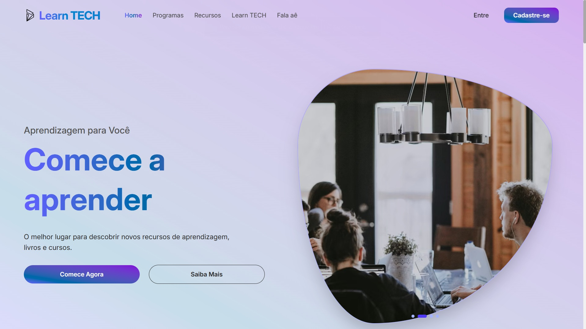
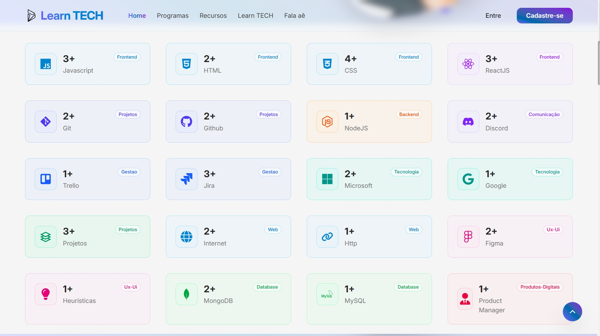
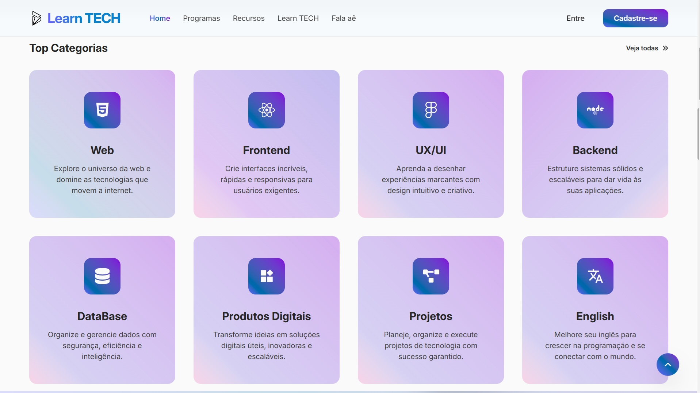
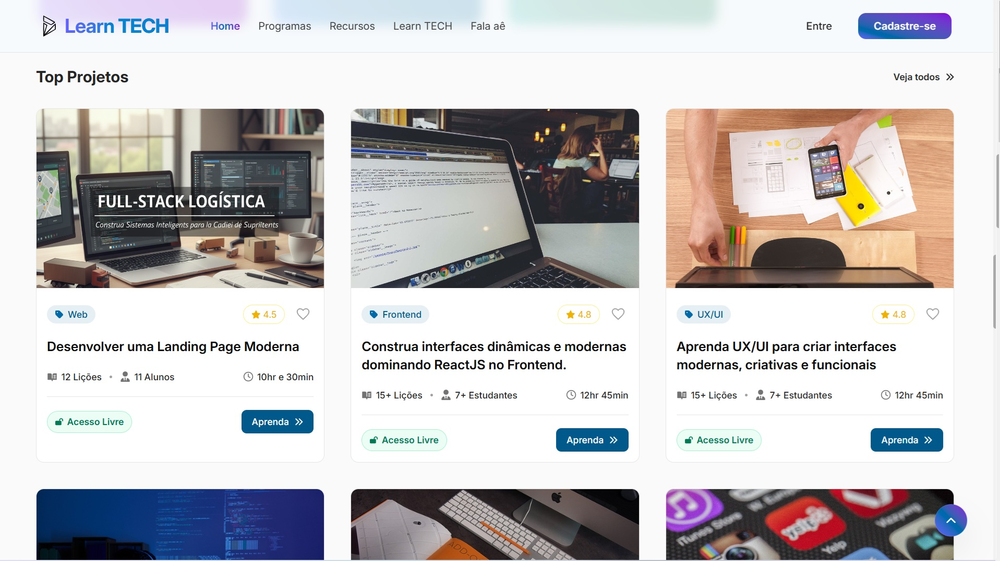
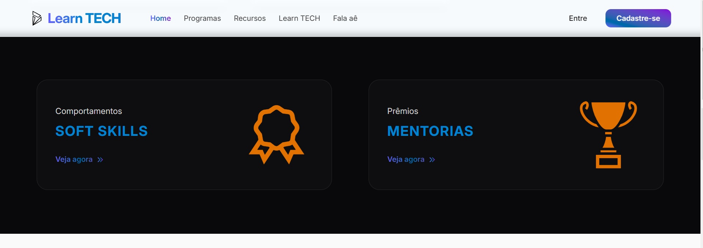
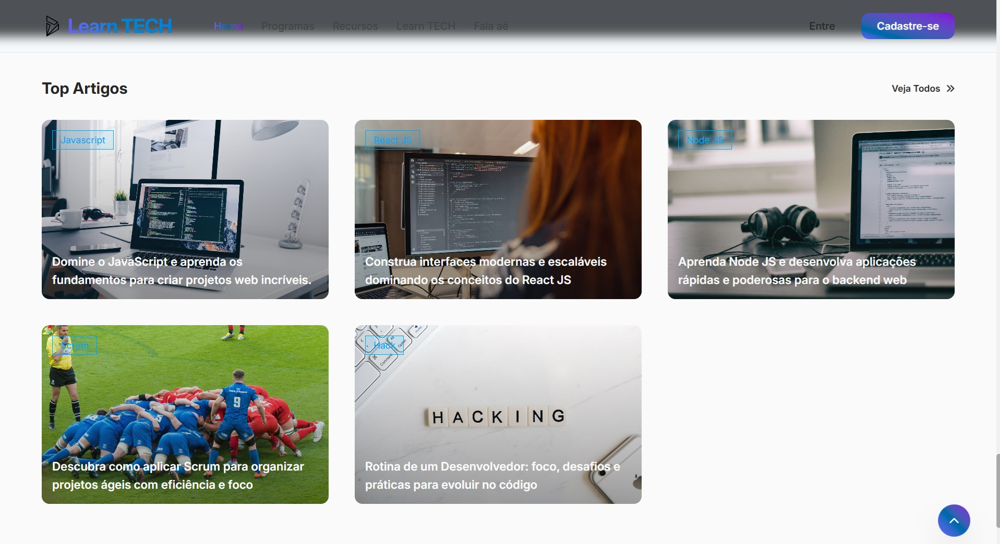
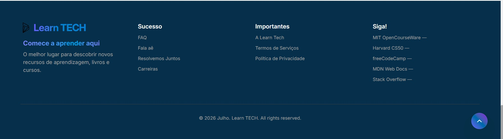
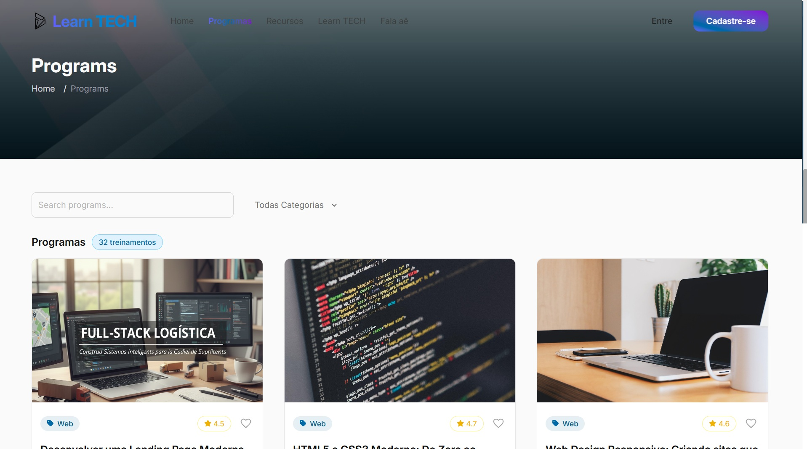
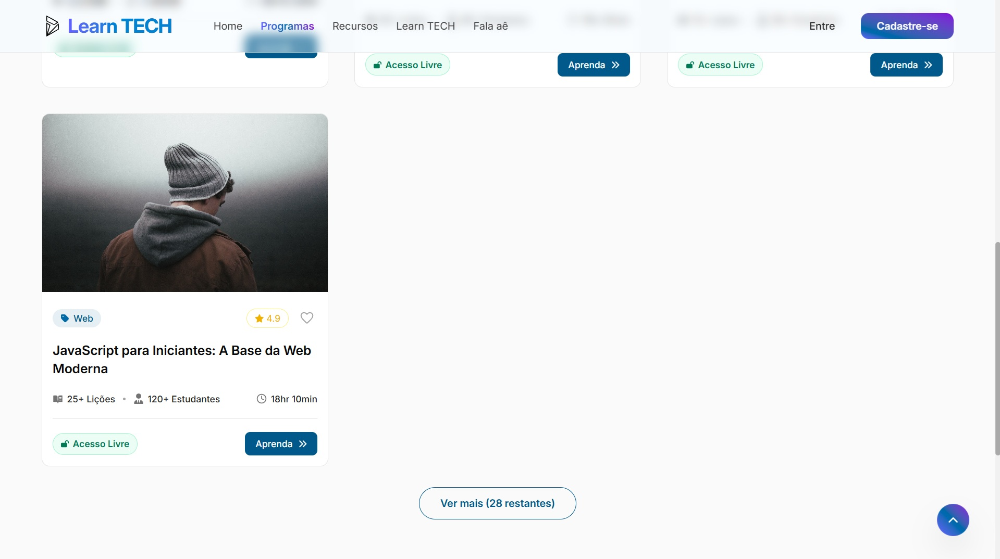
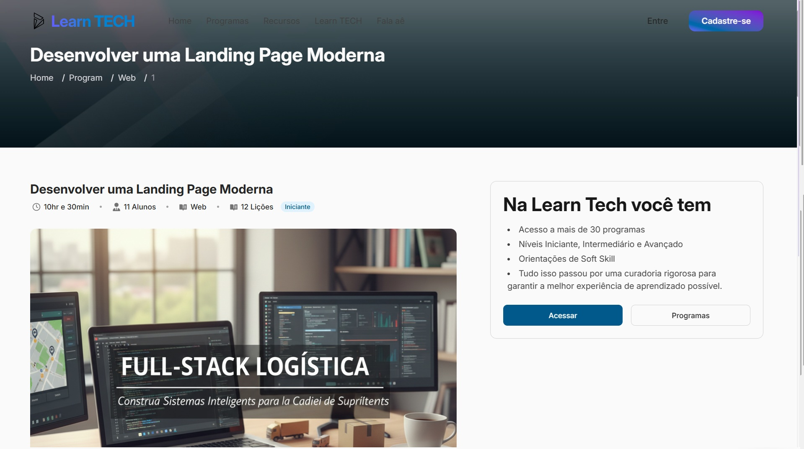
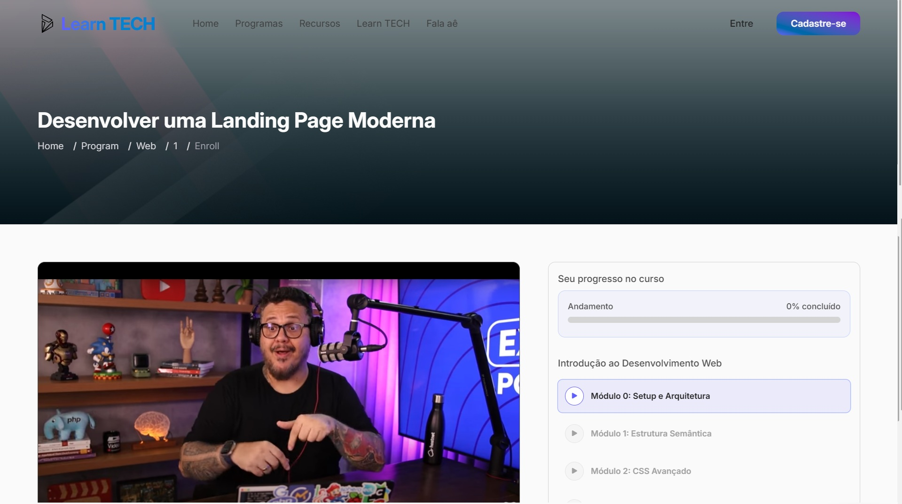
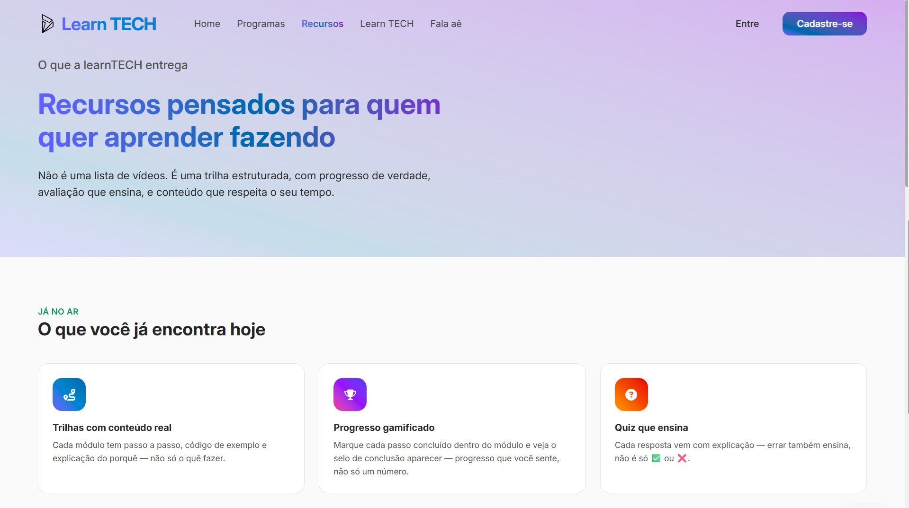
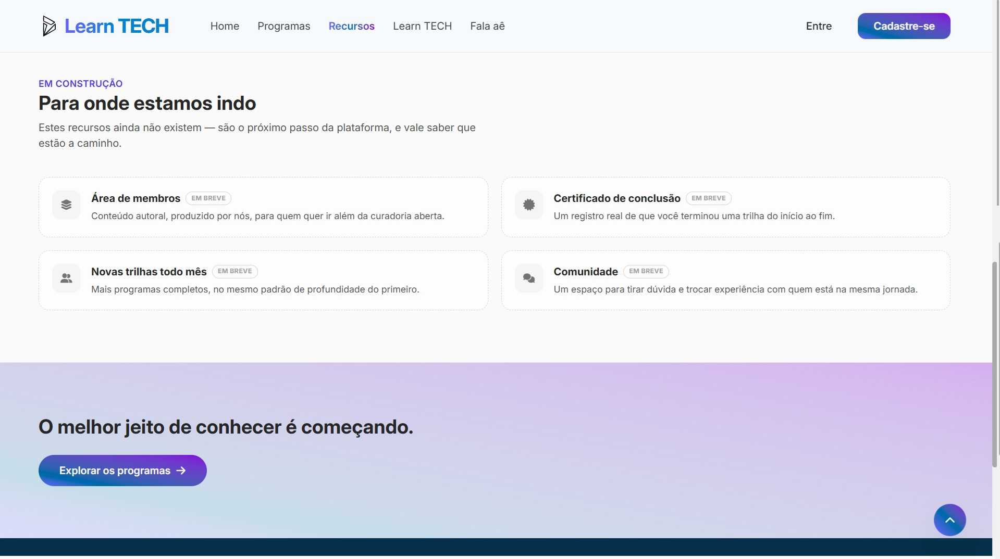
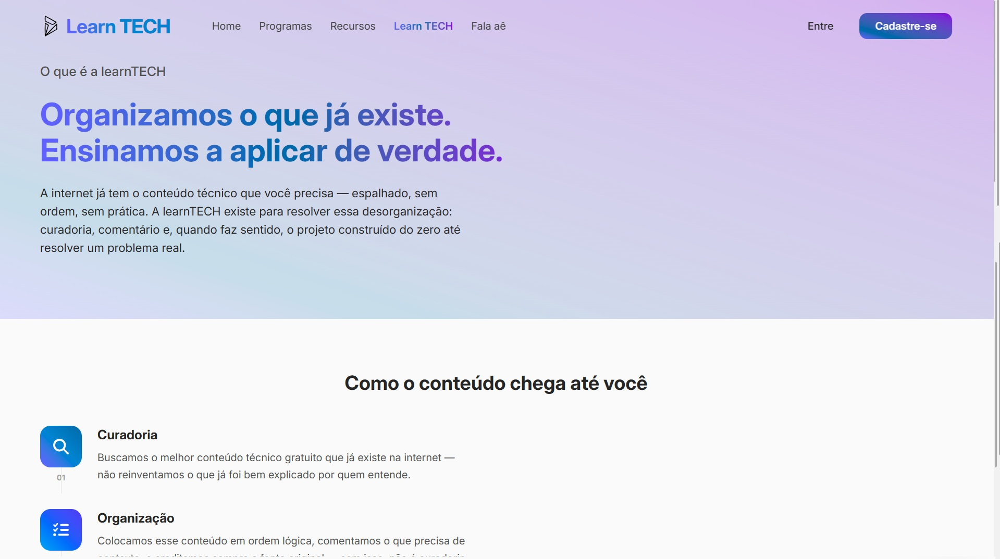
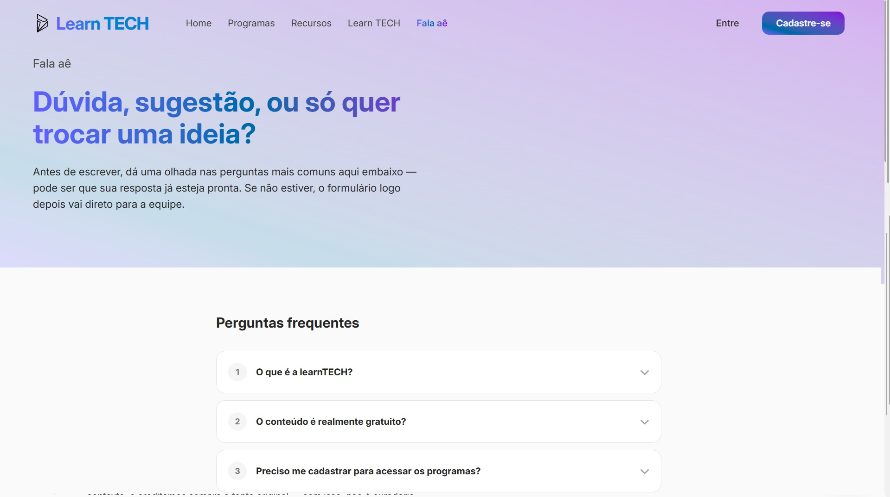

</details>

### 🗺️ Rotas

| Rota | Página |
| --- | --- |
| `/` | Home |
| `/programs` | Programas — busca, filtro e catálogo |
| `/program/:category/:id` | Apresentação do programa |
| `/program/:category/:id/enroll` | O treinamento |
| `/category` | Todas as categorias |
| `/resources` | Recursos |
| `/about` | Learn TECH |
| `/falaae` | Fala aê |
| `/aprender` | Aprender |
| `/careers` | Carreiras |
| `/blog/:id` | Artigo |
| `/softskills` · `/mentorias` | Em construção |
| `/terms` · `/privacy` | Termos e Privacidade |
| `*` | Não encontrado |

### 🌟 HOME

- [x] Imagem de destaque em carrossel
- [x] Index: nome e favicon
- [x] `LearnTechTitle`: logo reutilizável
- [x] Navbar: Home, Programas, Recursos, Learn TECH, Fala aê
- [x] Hero: subtítulo, título, descrição e dois botões CTA
- [x] Stats: contagem de conteúdos por tecnologia — Javascript, HTML, CSS, ReactJS, Git, GitHub, NodeJS
- [x] Categorias: listagem com ícone e descrição
- [x] Projetos: um card por categoria, com hover e botão "ver todos"
- [x] Comportamentos, Prêmios e Blogs
- [x] Footer com 4 colunas e copyright com o ano corrente
- [x] Botão fixo de voltar ao topo

### 🌟 PROGRAMAS

- [x] Busca por texto no título
- [x] Filtro por categoria
- [x] Contador de resultados
- [x] Paginação incremental: 4 cards, "Ver mais" carrega +6
- [x] Resultado memorizado com `useMemo`
- [x] Organização por faixa de id (ver tabela de categorias)
- [x] Uma página de apresentação para cada card

### 🌟 O TREINAMENTO

Como funciona a página de um programa inscrito:

- **Uma aba por módulo**, montada a partir de `modules[]`.
- Dentro do módulo, **os passos são uma checklist interativa**: o visitante marca o que concluiu e a barra de progresso do módulo acompanha.
- Ao concluir o módulo, o botão do final avança o progresso geral do programa. A navegação entre abas continua livre — visitar uma aba não marca nada.
- **O progresso geral** é a razão entre módulos concluídos e o total de módulos do programa, seja ele de 4 ou de 6.
- **O quiz** é do programa, não do módulo: cada questão aponta para o módulo que responde. Ao responder, o resultado aparece com a explicação.
- **O placar final** aparece quando todas as questões foram respondidas, com percentual de acerto.
- **O histórico de tentativas** registra cada rodada com data, hora e pontuação, e permanece depois de reiniciar.
- **Tudo é gravado no `localStorage`** sob a chave do programa, e recuperado ao voltar. Como não há conta de usuário, o progresso é do navegador.
- **Vídeo e pôster** são opcionais: só aparecem no programa que os define.

### 🌟 DEMAIS PÁGINAS

- [x] **Recursos**: conteúdos atuais e futuros do projeto
- [x] **Learn TECH**: propósito do projeto
- [x] **Fala aê**: FAQ e canal de comunicação com a equipe idealizadora
- [x] **Erro**: Não encontrado e Em construção
- [x] **Hospedagem**: Vercel, com `vercel.json` para o roteamento de SPA

---

## 🚀 VERSÃO 1 — histórico

Desenvolvimento do projeto inicial, mantido aqui como registro da origem. A arquitetura descrita nesta seção foi substituída pela Versão 2.

### 📚 LearnHub — Plataforma LMS Online Responsiva

🌟 Uma plataforma de Educação Online (LMS) desenvolvida com ReactJS e TailwindCSS, moderna, responsiva e com foco em experiência do usuário.

#### 🚀 Visão Geral

Projeto inspirado em plataformas como Udemy, trazendo recursos essenciais de um Learning Management System:

- Exibição de cursos, categorias e estatísticas
- Páginas de programas e detalhes
- Player de vídeo embutido
- Sistema de quizzes
- Blog integrado
- Design 100% responsivo

Construído passo a passo para ser acessível tanto a iniciantes quanto a desenvolvedores experientes.

#### 📖 Roadmap do Desenvolvimento

- 🎬 **Intro** — apresentação do objetivo do projeto: criação de uma plataforma LMS responsiva com ReactJS + TailwindCSS.
- ⚙️ **Project Setup** — configuração inicial com Vite, TailwindCSS e demais dependências.
- 🏠 **Home Page** — estrutura inicial da página principal com navegação e seções base.
- 🌟 **Hero Section** — seção de destaque com chamada principal e banner ilustrativo.
- 📊 **Stats Section** — exibição de estatísticas em cards.
- 📂 **Category Section** — listagem de categorias de cursos.
- 📚 **Programs Section** — apresentação dos programas disponíveis em cards.
- ⚡ **Quick Access Section** — navegação rápida entre recursos importantes.
- 📝 **Blog Section** — seção de artigos com conteúdo educativo.
- 📄 **Programs Page** — página dedicada aos programas.
- 🏞️ **Page Top Banner** — componente reutilizável de banner no topo das páginas internas.
- 🧭 **Breadcrumb** — componente de navegação por caminho de páginas.
- 📑 **Details Page** — página de detalhes de cada curso.
- 📝 **Enroll Programs Page** — página de inscrição no curso.
- 🎥 **Video Player Section** — componente de player de vídeo.
- 🖊️ **Description Section** — descrição completa do curso.
- 🗂️ **Tabs Components** — abas para alternar entre seções do curso.
- 📋 **Overview Tabs** — aba de visão geral.
- 📦 **Resources Tabs** — aba de recursos adicionais.
- ⭐ **Reviews Tabs** — aba de avaliações. *Removida na Versão 2: a plataforma não exibe avaliação que não consegue medir.*
- 📈 **Course Progress** — progresso do aluno dentro do curso.
- ❓ **Quiz Section** — quizzes interativos.
- 🔑 **Sign In Page** e 🆕 **Sign Up Page** — login e registro. *Removidas na Versão 2: a plataforma é OFF-only.*
- ✅ **Final Product** — plataforma LMS completa, responsiva e funcional.

#### 📷 Preview da versão 1

<details>
<summary>Ver as telas</summary>


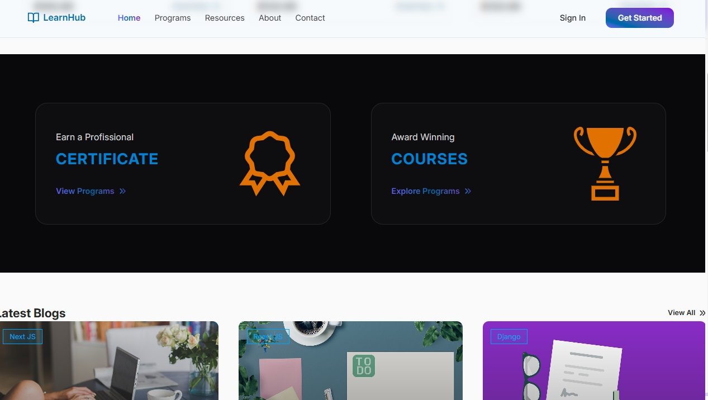
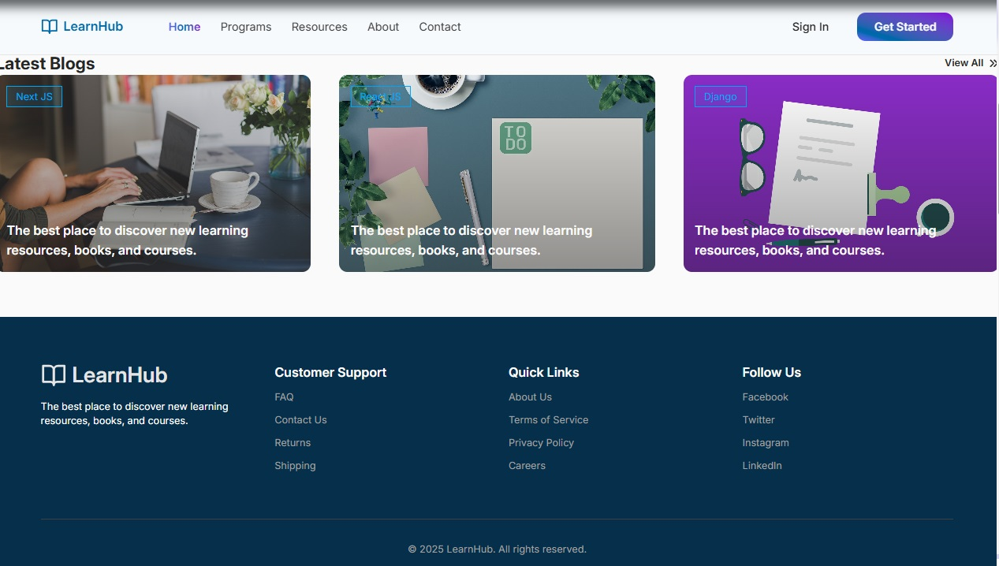


</details>

#### 🔗 Referências da versão 1

- G-Tech Official — *How to Create an Online LMS Education Website using React Js and Tailwind CSS*: https://www.youtube.com/watch?v=tiwu5UHCUhQ
- Template inicial: https://github.com/gtech-official08/lmssys-starter-template
- Vídeo demo: https://www.youtube.com/watch?v=C9Kj594dRxU
- Imagens: [Pixabay](https://pixabay.com/)

---

### 🚀 Por: [@douglasabnovato](https://github.com/douglasabnovato)